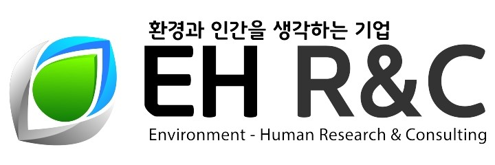

### Hi there, I'm Yohan Lee👋

- 🔭 I’m currently working on ...
   - Development of data-driven ML model with spatio-temporal structure for prediction of air polution
   - Development of indoor air quality & building energy balance model with ordinary differential equation (ODE)

- 🌱 I’m currently learning ...
   - Particle physics & Accelerator physics (PhD Student at Kyoto University)
   - ML & DL model for atmospheric environment (EH R&C at Korea)
   
- 📫 How to reach me: ...
   - E-mail: yh.lee@ehrnc.com
